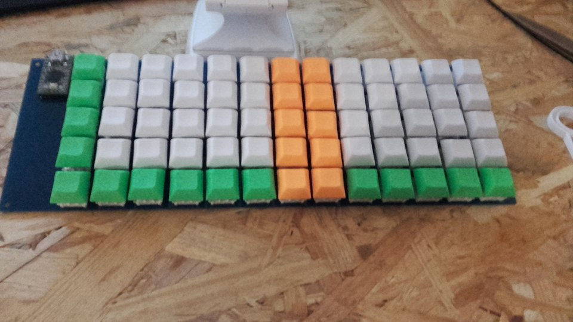

# Keyboard-v0
This repository hosts source files for my first DIY custom keyboard.

## Layout
Layout is available in json format and meant to be opened on [Keyboard Layout Editor](http://www.keyboard-layout-editor.com).

## Firmware
[QMK](https://github.com/qmk/qmk_firmware)

## Result
Having no plate or casing causes a lot of stress on the PCB. It bends if I press too hard near the center, but it doesn't break.  
Having no case causes the components to be exposed, and several tracks / diodes have been damaged and I have been forced to make small wire shorts to fix the keyboard regularly.
But I still used it daily for 2 years, and it was awesome !

